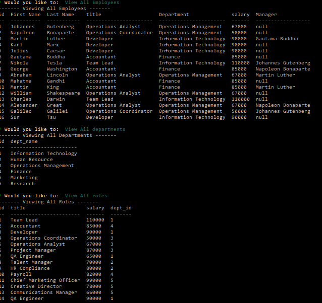

# Employee Tracker

## About This Project

This Program is being used as a CRM that will allow the user to see, and create their employees, roles, and departments.


To run this program:
```
npm i
node index.js
```

Video Demonstration:
[Watch Here](https://www.screencast.com/t/KaDuumXhzmq)

## Built With
- Javascript
- Node.JS
- Inquirer (npm)
- MySQL2 (npm)
- console.table (npm)

## Contact
If you wish to contact me for any questions or comments please contact me on github: 
* https://github.com/cpastorelli

## License
[](https://opensource.org/licenses/MIT)

## Acknowledgements
- [Error 1824](https://stackoverflow.com/questions/52377469/failed-to-open-the-referenced-table)
- [Foreign Key Constraint Fails](https://stackoverflow.com/questions/5005388/cannot-add-or-update-a-child-row-a-foreign-key-constraint-fails)
- [set Timeout](https://developer.mozilla.org/en-US/docs/Web/API/setTimeout)
- [Error 1054](https://sebhastian.com/mysql-error-1054-fix/#:~:text=The%20ERROR%201054%20in%20MySQL,UPDATE%20%2C%20or%20ALTER%20TABLE%20statement.)
- [Inquirer](https://www.npmjs.com/package/inquirer#documentation)
- [mysql2](https://www.npmjs.com/package/mysql2?activeTab=readme)
- [Console.Table](https://www.npmjs.com/package/console.table)
- [Joining 3+ tables](https://learnsql.com/blog/how-to-join-3-tables-or-more-in-sql/)

